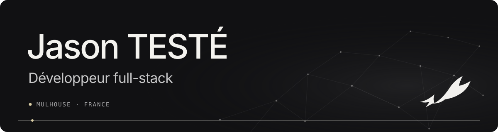

  

  <a href="https://www.jasonteste.com/"><strong>PORTFOLIO</strong></a>
  &nbsp;·&nbsp;
  <a href="https://www.jasonteste.com/projects/azzaprod">AZZAPROD CASE STUDY</a>
  &nbsp;·&nbsp;
  <a href="https://www.linkedin.com/in/jteste/">LINKEDIN</a>

## I help teams turn unclear needs into useful software

I bring product thinking and full-stack delivery together: clarify the real problem, shape a simple experience, build it across the stack, and stay with it through production.

## Featured work: AzzaProd

[Full case study](https://www.jasonteste.com/projects/azzaprod) · [Live website](https://azzaprod.com/)

A studio's old showcase wasn't putting its work first. I led the UX audit and product direction, then delivered a bilingual site built to make the studio's work clear and bring contact requests through reliably.

- Made the studio's work the focus from the first screen
- Made French and English project pages manageable without rebuilding each layout
- Preserved contact requests and offered an alternative when email delivery fails
- Took the site to production: hosting, domain, and email are configured

**Project stack:** Next.js · React · TypeScript · i18n · OVH · SMTP

## Tools I use

  
  
  
  
  
  
  

**Frontend:** React · React Native · Next.js · TypeScript  
**Backend & data:** NestJS · tRPC · PostgreSQL · Prisma · Zod  
**Delivery:** Docker · Traefik · OVH · Dokploy

## Looking for my next product team

I'm looking for a full-stack role where I can turn real user needs into clear, reliable software.

[See my portfolio](https://www.jasonteste.com/) · [Get in touch on LinkedIn](https://www.linkedin.com/in/jteste/)
