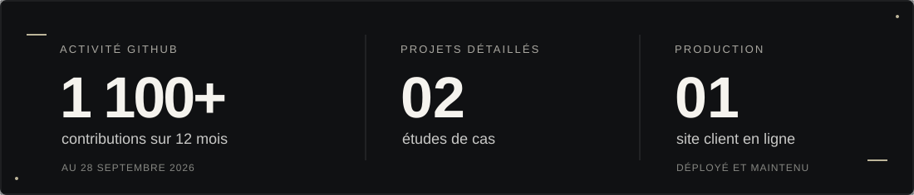

  

  <a href="https://www.jasonteste.com/"><strong>PORTFOLIO ↗</strong></a>
  &nbsp;&nbsp;·&nbsp;&nbsp;
  <a href="https://www.jasonteste.com/assets/cv.pdf">CV ↗</a>
  &nbsp;&nbsp;·&nbsp;&nbsp;
  <a href="https://www.linkedin.com/in/jteste/">LINKEDIN ↗</a>

  Je transforme des besoins parfois flous en applications simples à utiliser, 
  fiables et prêtes à servir au quotidien.

  

## Projets choisis

### 01 / AzzaProd — un studio qu’on comprend dès le premier écran

**En ligne · Site client bilingue · Déployé et maintenu**

Le studio avait déjà un site, mais ses réalisations passaient au second plan. J’ai mené l’audit UX, repensé le parcours, construit la vitrine en français et en anglais, puis pris en charge sa mise en ligne. L’équipe peut ajouter ses projets sans reconstruire les pages ; un problème d’envoi ne fait pas perdre la demande de contact.

`Next.js` · `React` · `TypeScript` · `i18n` · `OVH` · `SMTP`

**[Lire l’étude de cas ↗](https://www.jasonteste.com/projects/azzaprod)** &nbsp;·&nbsp; [Voir le site ↗](https://azzaprod.com/)

### 02 / Atelier Bozoïde — préparer, comparer, décider

**Produit personnel · v0.5 en développement**

Une application de préparation pour les joueurs de DOFUS : elle relie inventaire, recettes et objectifs pour montrer ce qu’on peut fabriquer et ce qu’il manque. Les simulations restent séparées des données du joueur. Les mêmes règles servent l’interface et les agents IA ; les résultats incertains d’une capture d’écran demandent confirmation.

`Next.js` · `React` · `TypeScript` · `tRPC` · `Zod` · `Prisma` · `PostgreSQL`

**[Découvrir le projet ↗](https://www.jasonteste.com/projects/atelier-bozoide)**

---

### Ce que j’apporte à une équipe

| Comprendre et concevoir | Construire et livrer |
| :--- | :--- |
| Clarifier le besoin, simplifier les parcours et faire parler le produit avant la technologie. | Relier interface, API et données ; faire évoluer le code ; aller jusqu’au domaine, à l’hébergement et aux services en production. |

Chez **Marcel**, j’ai aussi fait évoluer une application déjà utilisée, avec des pull requests et des revues de code en équipe.

  <strong>Je cherche une équipe produit où mettre cette approche au travail.</strong> 
  <a href="https://www.linkedin.com/in/jteste/">On en parle sur LinkedIn ↗</a>

